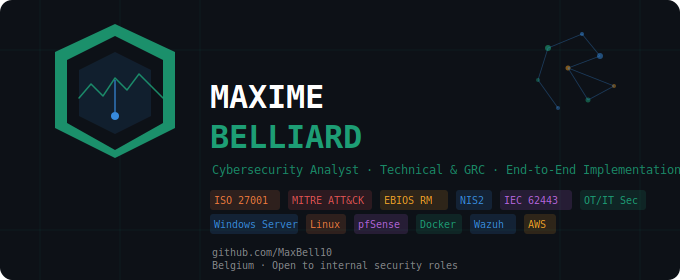

# Maxime Belliard
### Cybersecurity Analyst · GRC & Technical Security · Based in Belgium

---

## 👋 About Me

I'm a cybersecurity professional with a **Master's-level background (RNCP Level 7)** in security solutions development, looking to join an **in-house security team** where I can both implement and analyse cybersecurity solutions — from technical hardening to governance.

Before moving into cybersecurity, I spent years as a **QSE Manager and logistics operations leader**, which gave me a strong foundation in process discipline, regulatory compliance, and risk management — including **OT/IT environments**. I bring that operational mindset directly into security work.

My work focuses on:
- 🏢 **Active Directory** hardening and identity management
- 🔍 **SIEM deployment** and real-time threat detection
- 📋 **GRC** — ISO 27001:2022, NIS2, EBIOS RM risk methodology
- 🛡️ **Security monitoring** aligned with MITRE ATT&CK
- 🏭 **OT/IT risk** — understanding of operational technology environments and their security constraints
- 🔥 **Network security** — firewall rules, IDS/IPS with pfSense and Suricata, and network design and segmentation fundamentals
- ⚔️ **Attack & Defense** — hands-on attack simulation and detection in lab environments
- 🐧 **Linux** administration and hardening
- ⚙️ **Security automation** — Bash & PowerShell scripting

I build hands-on labs that mirror real enterprise environments, documented as portfolio evidence of both technical depth and governance awareness.

---

## 🎓 Certifications

| Certification | Issuer | Year |
|---|---|---|
| Master's-level Degree in Security Solutions Development (RNCP Level 7) | AN21 / CSB School | 2024 |
| ISO/IEC 27001 Provisional Implementer | PECB | 2024 |
| EBIOS Provisional Risk Manager | PECB | 2024 |
| Certified in Cybersecurity (CC) | ISC2 | 2026 |
| SecNumacadémie — 4 modules (4×100%) | ANSSI | 2022 |

---

## 🗂️ Portfolio Projects

### 🛡️ [Active Directory Security Lab](https://github.com/MaxBell10/active-directory-security-lab) · `Complete`
> Windows enterprise environment with AD, GPO hardening, and SIEM integration

**Stack:** Windows Server 2022 · Windows 10 Pro · Wazuh 4.14.4 · VirtualBox

**Key implementations:**
- Active Directory structure with OU design and least-privilege RBAC
- GPO-enforced password policy, account lockout, USB blocking, screen lock
- Wazuh SIEM with real-time detection of Event ID 4625 / 4740 / 4728
- Brute-force simulation via SMB — correlated to MITRE ATT&CK T1110, T1078
- Regulatory mapping: ISO 27001:2022 · NIS2 Art. 21 · CIS Controls 5 & 8

---

### 🔥 Network Security Lab · `In progress`
> pfSense firewall, segmentation rules, Suricata IDS/IPS

---

### 📋 GRC & Risk Lab · `Planned`
> EBIOS RM audit report, NIS2 compliance assessment, IEC 62443

---

### ⚙️ Security Automation · `Planned`
> Bash & PowerShell hardening scripts

---

## ⚖️ Regulatory & Framework Coverage

| Framework | Area |
|---|---|
| **ISO 27001:2022** | A.8 Technological controls — A.8.3 Information access restriction |
| **ISO 27001:2022** | A.8.15 Logging |
| **NIS2 Art. 21** | Technical security measures — authentication, access control, monitoring |
| **EBIOS RM** | Risk identification, threat scenarios, security baseline |
| **MITRE ATT&CK** | T1078, T1110, T1110.001, T1484, T1531, TA0004, TA0005 |
| **CIS Controls** | Control 5 — Account Management · Control 8 — Audit Log Management |

---

## 🛠️ Tools & Technologies

---

*All lab environments are fictional and used solely for educational and portfolio purposes.*

