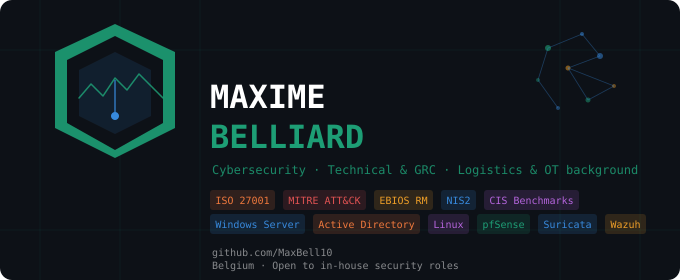

[-FF0000?style=flat-square)](https://www.comptia.org)
[-1BA0D7?style=flat-square&logo=cisco&logoColor=white)](https://www.cisco.com)

---

## 👋 About Me

I'm a cybersecurity professional with a **Master's Degree (RNCP Level 7)** in security solutions development, looking to join an **in-house security team** where I can both implement and analyse cybersecurity solutions — from technical hardening to governance.

Before moving into cybersecurity, I spent years as a **QSE Manager and logistics operations leader**, which gave me a strong foundation in process discipline, regulatory compliance, and risk management — including **OT/IT environments**. I bring that operational mindset directly into security work.

My work focuses on:
- 🏢 **Identity & Access Management** — Active Directory hardening, GPO, least-privilege RBAC
- 🔍 **SIEM & Threat Detection** — Wazuh, real-time alerting, MITRE ATT&CK correlation
- 📋 **GRC** — ISO 27001:2022, NIS2, EBIOS RM, IEC 62443
- 🏭 **OT/ICS Security** — Purdue Model, IT/OT segmentation, legacy system risk
- 🔥 **Network Security** — pfSense, Suricata IDS/IPS, VLAN segmentation
- ⚔️ **Attack & Defense** — Purple Team exercises, attack simulation, incident response
- ☁️ **Cloud Security** — AWS, Terraform IaC, GuardDuty, CloudTrail
- ⚙️ **Security Automation** — Bash & PowerShell scripting, DevSecOps, GitHub Actions

All projects are part of a **unified fictional enterprise program** — LogiSecure SA — simulating a real CISO portfolio across 16 interconnected labs.

---

## 🎓 Certifications

| Certification | Issuer | Year |
|---|---|---|
| Expert en Développement de Solutions Sécurité (RNCP Level 7) | AN21 / CSB School | 2024 |
| ISO/IEC 27001 Provisional Implementer | PECB | 2024 |
| EBIOS Provisional Risk Manager | PECB | 2024 |
| Certified in Cybersecurity (CC) | ISC2 | 2026 |
| SecNumacadémie — 4 modules (4×100%) | ANSSI | 2022 |
| CompTIA Security+ | CompTIA | In progress |
| Cisco CCNA | Cisco | In progress |

---

## 🏢 LogiSecure SA — Fictional Enterprise Context

All labs simulate the security programme of **LogiSecure SA**, a fictional Belgian logistics operator (500 employees, Brussels HQ) subject to **NIS2**, **ISO 27001**, and **IEC 62443**.

| Infrastructure | Details |
|---|---|
| **IT** | Active Directory `lab.local` · pfSense · Wazuh SIEM · AWS |
| **OT** | Conveyor HMI (Windows 7 legacy) · PLC · WMS · Historian SCADA |
| **Suppliers** | TechLogix BVBA · ConveyorPro GmbH · DataAPI SAS |
| **Key risks** | Ransomware · IT→OT lateral movement · API data leak · Supply chain |

---

## 🗂️ Portfolio — LogiSecure Enterprise Security Program

> 📌 **[logisecure-enterprise-security-program](https://github.com/MaxBell10/logisecure-enterprise-security-program)** — Hub · CISO dashboard · Risk register · Executive summary
>
> Planned projects are listed by name and linked once their repository is published. Their figures are targets, not results.

### Part 1 — Build the Lab

| Repository | Status | Key Metric |
|---|---|---|
| [logisecure-active-directory](https://github.com/MaxBell10/logisecure-active-directory) | ✅ Completed | PingCastle 55/100 · 4 GPOs · Wazuh SIEM |
| [logisecure-pfsense-segmentation](https://github.com/MaxBell10/logisecure-pfsense-segmentation) | ✅ Completed | 12 firewall rules · Suricata alerts in Wazuh (T1046) · OpenVAS validated against nmap |
| logisecure-ebios-rm-assessment | 📋 Planned | 3 strategic scenarios · MITRE-mapped |
| logisecure-bash-automation | 📋 Planned | 9 scripts · GPG-signed · GitHub Actions CI |
| logisecure-attack-simulation | 📋 Planned | Kill chain · AD + pfSense + Wazuh correlation |

### Part 2 — Expand the Skills

| Repository | Status | Key Metric |
|---|---|---|
| logisecure-ot-network-security | 📋 Planned | Purdue Model · 3 VLANs · Modbus ACL |
| logisecure-pki-kms | 📋 Planned | 2-tier PKI · 4 certs · CRL · GPG-signed scripts |
| logisecure-honeypot-threat-intel | 📋 Planned | Cowrie · STIX IOC export · Wazuh rules |
| logisecure-container-security | 📋 Planned | kube-bench · SBOM · target > 90% critical CVE reduction |
| logisecure-cloud-security | 📋 Planned | Terraform IaC · GuardDuty · CloudTrail |
| logisecure-forensics-ir | 📋 Planned | PICERL · TheHive · memory & disk forensics |
| logisecure-redteam-blueteam | 📋 Planned | Purple Team · target MTTD < 120s · ≥ 11/13 MITRE techniques detected |

### Part 3 — Govern the Risk

| Repository | Status | Key Metric |
|---|---|---|
| logisecure-legacy-ot-security | 📋 Planned | Virtual patching · target risk CRITICAL → MEDIUM |
| logisecure-supply-chain-risk | 📋 Planned | 3 vendors · SBOM Syft/Grype |
| logisecure-iso27001-audit | 📋 Planned | Target ≥ 20 Annex A controls audited · NCs documented |

---

## 📊 Consolidated CISO Dashboard

> Status reflects what is currently evidenced in the repositories. 📋 Target values are the objectives set for projects not yet delivered, not results.

| KPI | Value | Repository | Status |
|---|---|---|---|
| Firewall rules implemented | 12 (5 LAN · 4 DMZ · 3 WAN) | logisecure-pfsense-segmentation | ✅ Achieved |
| DMZ→LAN traffic blocked | 100% — evidenced in firewall logs | logisecure-pfsense-segmentation | ✅ Achieved |
| IDS detection in the SIEM (ET SCAN / T1046) | DMZ→LAN alerts raised in Wazuh, MITRE-mapped | logisecure-pfsense-segmentation | ✅ Achieved |
| Network segments | 2 live behind the perimeter (LAN, DMZ) | logisecure-pfsense-segmentation | ✅ Achieved |
| Network segments | 5 (+ OT Ctrl, OT Field, Cloud) | logisecure-ot-network-security · logisecure-cloud-security | 📋 Target |
| Custom Wazuh rules | 5 / 15 | logisecure-active-directory · logisecure-pfsense-segmentation · logisecure-honeypot-threat-intel · logisecure-forensics-ir · logisecure-redteam-blueteam | 🔄 Partial |
| Purple Team MTTD | < 120 seconds | logisecure-redteam-blueteam | 📋 Target |
| MITRE techniques detected | ≥ 11 / 13 tested | logisecure-redteam-blueteam | 📋 Target |
| Critical Docker CVE reduction | > 90% | logisecure-container-security | 📋 Target |
| Legacy OT risk level | CRITICAL → MEDIUM | logisecure-legacy-ot-security | 📋 Target |
| ISO 27001 Annex A controls audited | ≥ 20 | logisecure-iso27001-audit | 📋 Target |
| Suppliers assessed | 3 | logisecure-supply-chain-risk | 📋 Target |

---

## ⚖️ Regulatory & Framework Coverage

| Framework | Coverage |
|---|---|
| **ISO 27001:2022** | Annex A — A.5 Policies · A.6 People · A.7 Physical · A.8 Technological |
| **NIS2 Art. 21** | Risk management · Supply chain · Access control · Incident handling · Continuity |
| **IEC 62443** | SL1–SL2 · SR 1.1–1.3 · SR 5.1–5.4 · Purdue Model · IT/OT segmentation |
| **EBIOS RM** | 5 workshops · Strategic & operational scenarios · Residual risk treatment |
| **MITRE ATT&CK** | T1046 · T1078 · T1110 · T1484 · T1566 · T1195 · T1562 + ICS: T0862 · T0859 · T0814 |
| **CIS Controls** | Control 5 — Account Mgmt · Control 8 — Audit Logs · Control 12 — Network Infra |

---

## 🛠️ Tools & Technologies

---

*All lab environments simulate the fictional enterprise LogiSecure SA, used solely for educational and portfolio purposes.*

